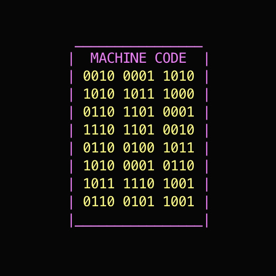

# ¿Qué es un programa informático?
## Un programa informático es una secuencia de instrucciones escritas que una computadora interpreta para realizar una tarea específica o resolver un problema. O dicho de otro modo, un conjunto de texto o 'código' en lenguaje de programación para indicarle a una computadora qué hacer y cómo hacerlo.
## Existen diferentes tipos de código, dependiendo de su finalidad.
- ## *Código fuente:* Es el código que escribe el programador. Es lo que podemos leer, comprender y modificar.

- ## *Código objeto:* Es el código fuente, que ha sido traducido por un compilador a un lenguaje que el ordenador pueda entender mejor (denominado lenguaje de bajo nivel). No suele ser directamente comprensible por una persona.
- ## *Código ejectuable:* Es el código que está preparado para que el ordenador lo ejecute y pueda ya realizar la tarea.

## _Para crear un programa informático hay que atravesar varias etapas:_
- ## *Análisis de requisitos:*
  - ### Básicamente es saber qué es lo que quieres o necesitas que haga el programa en función de las necesidades.
- ## *Diseño:*
  - ### Es la parte más importante, ya que aquí parten los pilares fundamentales para realizarlo; En el diseño se piensa cómo va a ser la estructura del programa, qué tipo de arquitectura utilizará, qué datos necesita, qué interfaz se planteará...
- ## *Programación:*
  - ### Aquí los programadores se encargan de llevar a cabo la escritura de código en función del diseño anteriormente planteado.
- ## *Pruebas:*
  - ### Una vez que la programación esté terminada o se crea terminada, se pone a prueba el programa para comprobar su correcto funcionamiento, detectar y solventar errores y realizar algunas correcciones o mejoras
- ## *Instalación:*
  - ### Una vez realizadas todas las fases anteriores, se considera que el programa ya está listo para los usuario o usuarios, por lo que se procede a instalar en el entorno que haya sido requerido.
- ## *Mantenimiento:*
  - ### Una vez que el usuario final accede al programa, se trata de pulir los últimos detalles. En cada equipo pueden surgir diferentes fallos que no fueron detectados hasta entonces, así como algún cambio que pueda ajustar el cliente final en función a sus necesidades.
